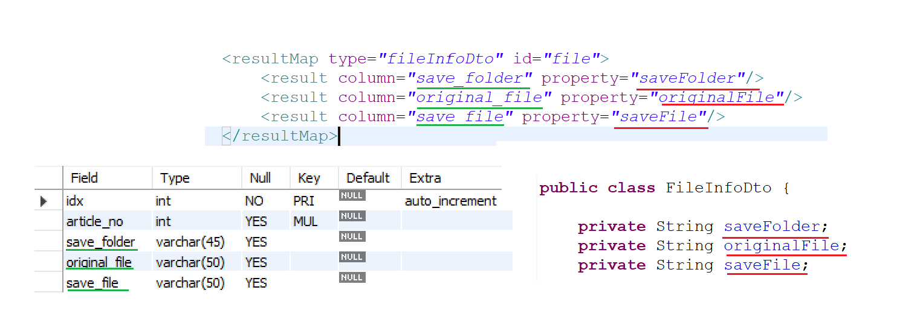

# Spring Boot API 

api서버는 크게 4단계로 나뉜다.

* axios나 fetch등의 비동기 통신요청을 받아서 처리하는 controller
* controller에서 가져올 데이터들을 제공하는 service
* service와 mapper.xml 사이를 중개할 mapper class
* sql 쿼리문을 실행하는 mapper.xml

아래에선 간단한 예제를 통해서 각 구조가 어떻게 연동되어 있는지 나타내고자 한다.

두번째 사진에서 BoardMapper가 board.xml을 인식하기 위해서,
board.xml이 java dto를 사용하기 위해서는 location 설정과 alias 설정을 해야한다.

* 사전세팅, BoardMapper에서 board.xml을 인식하기 위한 mybatis location 설정.
* board.xml에서 java dto를 인식하고, dto 멤버의 이름이 같을경우 자동 매핑시키기 위한 dto location 설정.
* 해당 설정은 applications.properties에 저장되어있음.

* 각 xml 파일 상단에 해당하는 mapper의 location을 설정함.

이렇게 설정한 뒤 query문을 수행하게 된다. 만약, db table의 column명이 dto의 멤버와 다르다면, resultMap을 이용해서 매핑시켜줘야 한다.

위와같은 순서로 controller는 각 crud패턴에 맞는 기능들을 db와 front 서버사이를 매개하며 수행한다.